# Documentation

## Deployment

There are two methods:

1. Using Docker via the provided [docker-compose.yml](../docker-compose.yml) file.
2. Using Ansible via [IOI automation scripts](https://github.com/ioi/automation/tree/master/translation).

It is advised to add Nginx basic auth on top of the public URL.

IMPORTANT: Make sure all URLS under `/media/*` should NOT be publicly accessible without auth, as it contains the PDF files of the tasks.

The IOI automation scripts already take care of the above security concerns.


## Basic Concepts

There are three main administrator roles: admin, ISC, and staff.

Firstly, admin adds countries and languages data. Then, for each country (also called "team"), admin creates a user for the team, which is a pair of (country, language).

A team can be:

- **translating**: The team can translate the tasks in the system to their language.
- **not translating**: The team can only read the tasks in the system.

A team consists of:

- One or more **leaders**, which will receive the team user account for task translation.
- Zero or more **on-site contestants**, which will receive printed task translations.
- Zero or more **online contestants** (since IOI 2022), which will NOT receive printed task translations.

A team which has one or more on-site contestant is referred to as "on-site team".

Before the start of a contest translation day, admin creates a contest in the system. Then, ISC creates the tasks for the contest. For each task, ISC adds the problem statement in English, and then release a version.

After all tasks have been released, admin then marks the contest as public. After which, each team can log in and see the tasks, then start translating. A translating team can also choose not to translate some tasks.


During the translation session, staff can monitor the translation status of all teams. On-site teams can also request to print their current translation for a task, which will be monitored by staff as well.

When a team has finished translating, they can finalize the translation by clicking a submit button. On-site teams can also request the translations of at most two other languages to print for the on-site contestants. Staff will see the finalized status, and then print the translations accordingly, one copy per language per task per on-site contestant.

When the translation (and requested translations from other languages, if any) for a team have been printed, the team leaders can verify the translations, and then staff can mark the translation status as "sealed". This is the end of the translation session for the team.

## User Management

There are 3 administrator users: `admin`, `ISC`, and `staff`. The IOI automation scripts will add those users. If Docker is used, the users will need to be added manually:

```
docker-compose exec app bash
```

and then:

```
python3 manage.py loaddata initial_data.json
```

The roles of the users are as follows:

- `admin`: has full access to the Django admin interface.
- `ISC`: manages tasks.
- `staff`: monitors translations.

(ISC stands for International Scientific Committee.)

### Changing administrator user passwords

Initially, each of the administrator user's password is the same as the username. For security reasons, we need to change the passwords of all the three users. To do this, log in as `admin`, go to `Trans` -> `Users`, select a user, and change the password using the provided form:

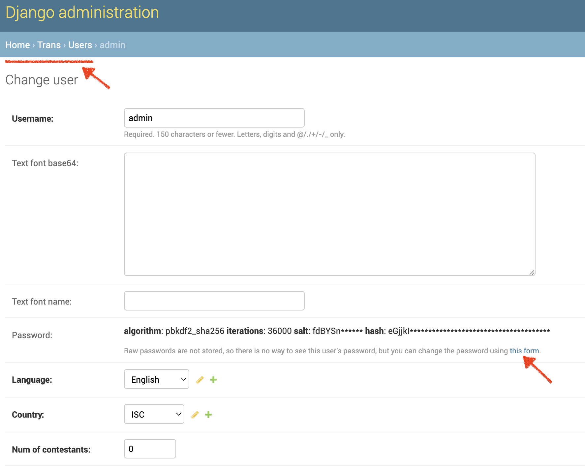

### Adding countries and languages

Default countries and languages data are provided at `data/countries.csv` and `data/languages.csv`. Modify them as necessary.

Then, log in as `admin`, go to `Trans` -> `Countrys` -> `Import`, select the CSV file, choose the `csv` format, and click `Submit`. Do similarly for languages.

| 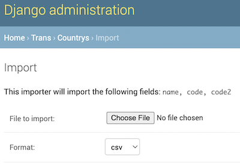 |  |
|-|-|

### Adding users

Similarly, we will import the users via a CSV file. Usually, one country (team) will get one shared user account for all translators in the same country. See the default CSV file at `data/users.csv`. Modify the file as necessary. Here is the explanation of each column:

- `username`: the username, in most cases should be equal to the `country`.
- `raw_password`: the password (generate it).
- `country`: the 3-letter code country of this user.
- `language`: the language this user is translating into. Set as `en` if this user is not translating.
- `num_of_contestants`: the number of contestants attending the contest on-site. This will be used by the system to determine the number copies that each task should be printed for a country. (For example, in IOI 2022, which was a hybrid IOI, the value varied between 0 and 4.)

## Contest & Task Management

### Adding contests

To add a contest, log in as `admin`, go to `Trans` -> `Contests` -> `Add contest`:

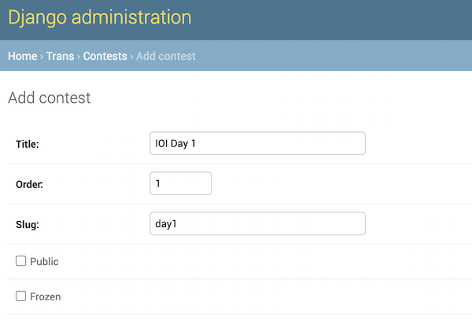

### Adding tasks

To add a task, log in as `ISC`. Then, click the menu on the top-right corner, and select `Add New Task`:

| 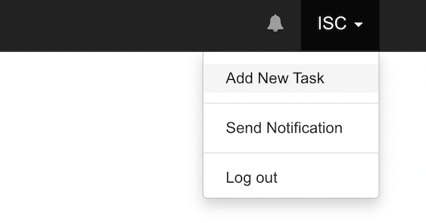 | 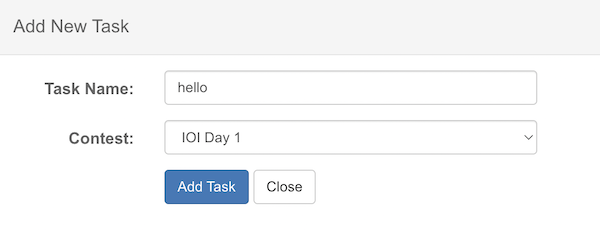 |
|-|-|

### Writing task statements

ISC can start adding task statement via the editor on the left side:

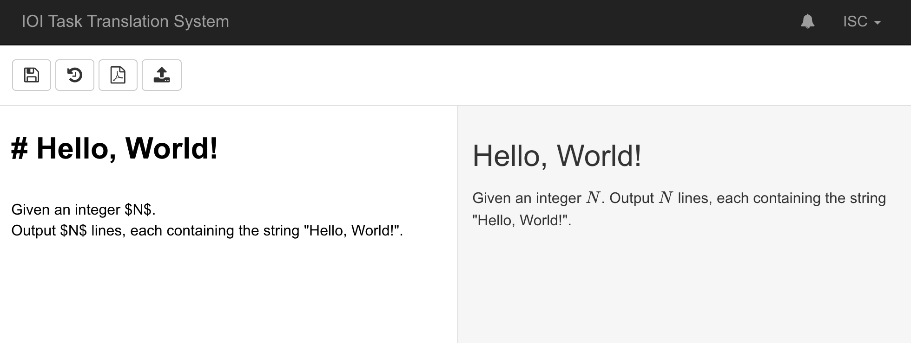

The statement should be added in Markdown format. Mathematical expressions are supported using [KaTeX](https://katex.org/) syntax.

It is advisable to write each sentence in a separate line, to make it easier for the translators to track the translation.

To insert an image in the task statement, admin must first upload the image file as an attachment (`Trans` -> `Attachments`):

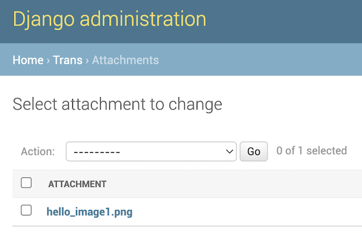

then, the image can be added in the statement using this Markdown syntax: ``.

### Releasing ISC version

Once the statement of a task is final, ISC should release a version for the task:

| 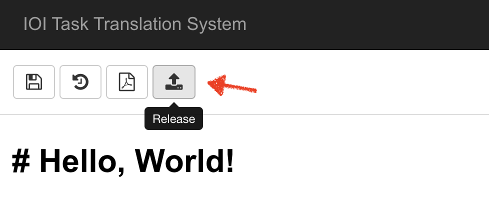 | 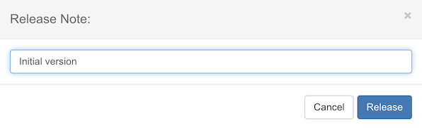 |
|-|-|

Continue adding all tasks for the contest.

### Making contests public

After ISC has added all tasks for a contest, admin can make the contest public by ticking the `Public` checkbox:

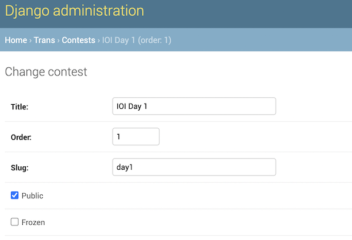

Once a contest is public, users will be able to see the latest released version of each task in the contest:

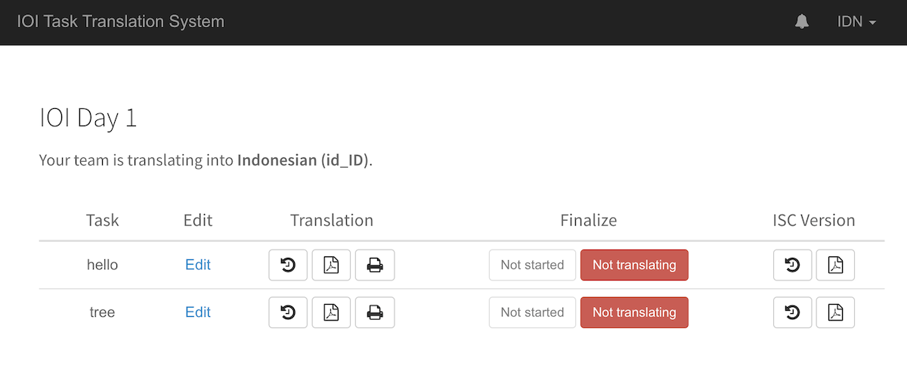

## Monitoring Translations

### Viewing overall translation status

Upon login, the `staff` user will be presented with the translation status of all teams.

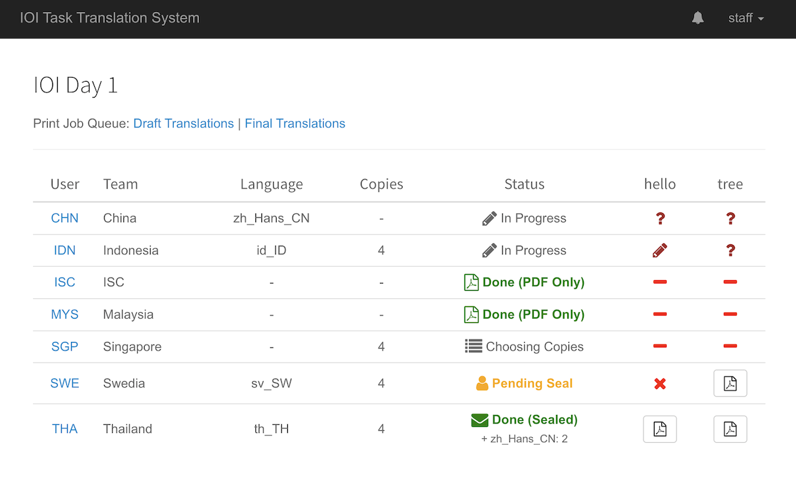

The User, Team, and Language columns are self-explanatory.

The Copies column denotes the number of copies that a task must be printed for the team. Basically, equals to the number of on-site contestants (the `num_of_contestants` column when importing users).

The Status column denotes the status of the overall translation:

- `In Progress`: the team has not finalized the translation yet.
  - Next action for the team: finalize the translation.
- `Done (PDF Only)`: the team does not have any contestants on-site, and is not translating.
  - This is a terminal state.
- `Choosing Copies`: the team is not translating, and has not finalized.
  - Next action for the team: choose additional languages to print, and finalize.
- `Pending Seal`: the team has finalized the translation.
  - Next action for the team: wait for the printed translations.
    - When they are ready, team to verify and seal them.
- `Done (Sealed)`: the team has verified and sealed the translations.
  - This is a terminal state.

If a team requested additional languages to print, the language code(s) are shown below the status.

Each of the last columns denotes the translation status of a task:


- :heavy_minus_sign: : Not applicable because the team is not translating
- :grey_question: : Not started yet
- :pencil2: : Started but not finalized
- :heavy_multiplication_x: : The team decides not to translate this task
- :page_facing_up: : Finalized

### Updating translation status

Staff can click on each row in the User column, which will redirect to the detailed translation status of that user (team):

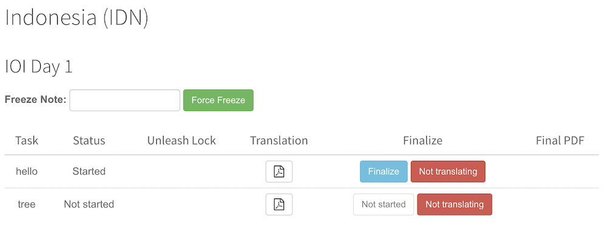

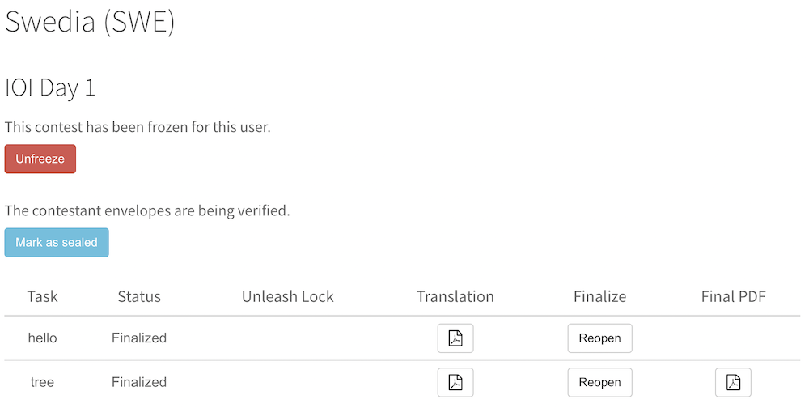

Here, staff can:

- Force-finalize (freeze) team's overall translation or individual task translations.
- Force-reopen (unfreeze) team's overall translation or individual task translations.
- Mark contestant envelopes (containing printed translations) as sealed by the team, which will mark the translation as done.

### Showing public translation status

We can show the overall translation status to all teams in the translation room, by clicking the `Public View` menu:

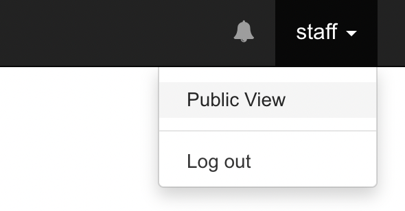

This will show the same data, but it is split into multiple tables, so that the whole teams can be visible on a single large screen:

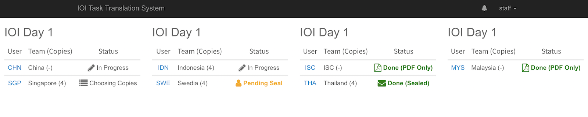

## Handling Printing Queues

For each contest, there are two printing queues: **draft** and **final** translation jobs.

### Draft translations queue

A print job in this queue represents one print request for a current translation version of a task by a team. It will be created each time the following button is clicked:

  |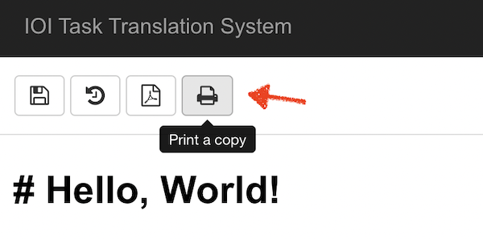|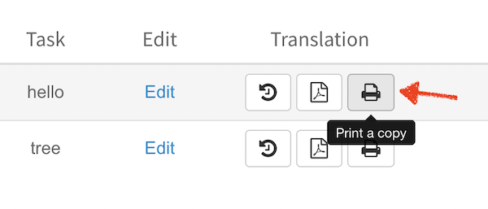|
  |-|-|

### Final translations queue

A print job in this queue represents an on-site team that has finalized their translation. There will be (at most) one such print job per on-site team.

### Viewing print job queue

Staff can visit the dashboard for draft and final printing queue by clicking on the following links:

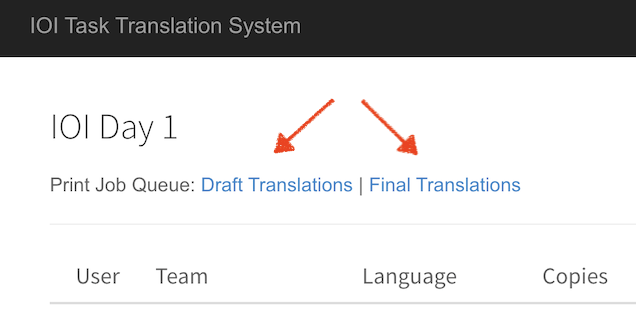

The page shows the file(s) to print for each team, and how many copies.

|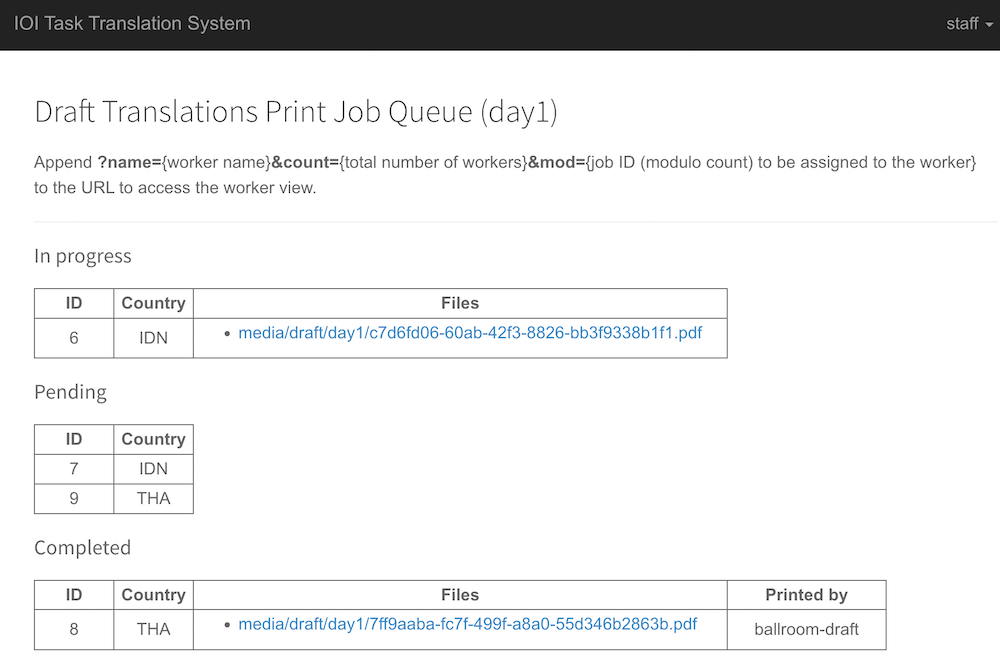|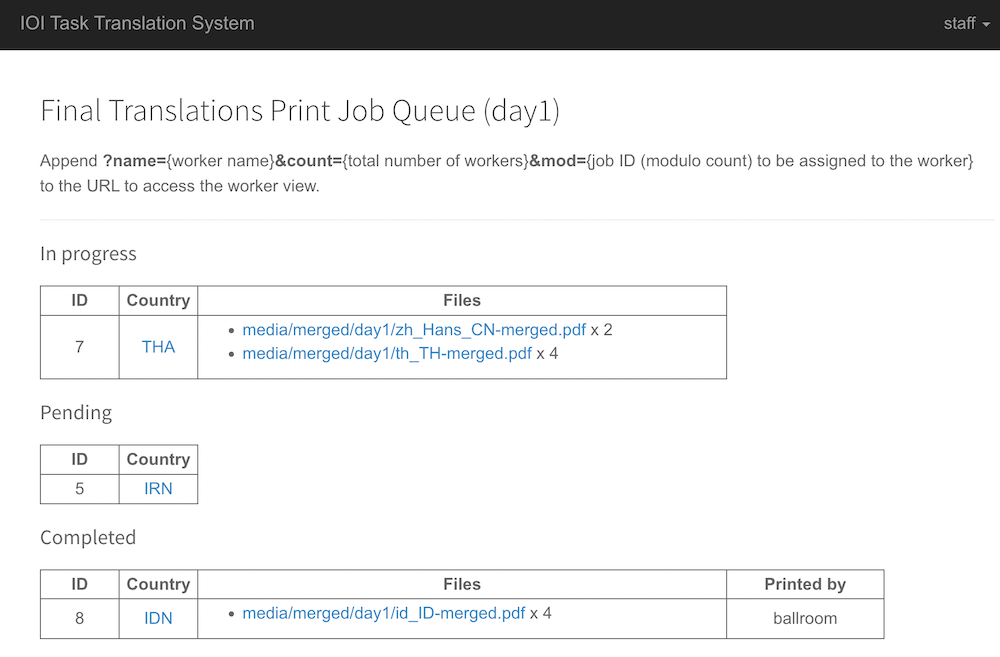|
|-|-|

### Printing jobs

Each queue can be handled by one or more "worker". A worker represents one physical printer station, attended by a runner.

We can distribute the load between available printers. Suppose that there are 3 printers. We can set so that:

- the first printer gets all jobs with ID = 0 (mod 3)
- the second printer gets all jobs with ID = 1 (mod 3)
- the third printer gets all jobs with ID = 2 (mod 3)

As instructed in the page, to see the worker view, append `?name={worker name}&count={worker count}&mod={job ID mod}`. Some examples:

- `?name=ballroom-draft&count=1&mod=0`
- `?name=ballroom&count=1&mod=0`
- `?name=ballroom&count=3&mod=2`

|||
|-|-|

The runner at each printer station can then pick up a job, click on each file and print one or more copies of the document, and then mark the job as complete.

**NOTE**: As explained above the printing itself is done manually by the runners. It is NOT automated! This system is not connected to any printer.

After completing a final translation print job, the runner should collect the printed documents and contestant envelopes, reach out to the team leaders, and seal the envelopes. Then, the runner should click on the country link, and then click the "Mark as sealed" button.


