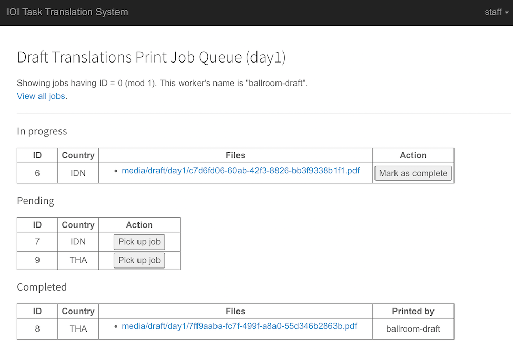
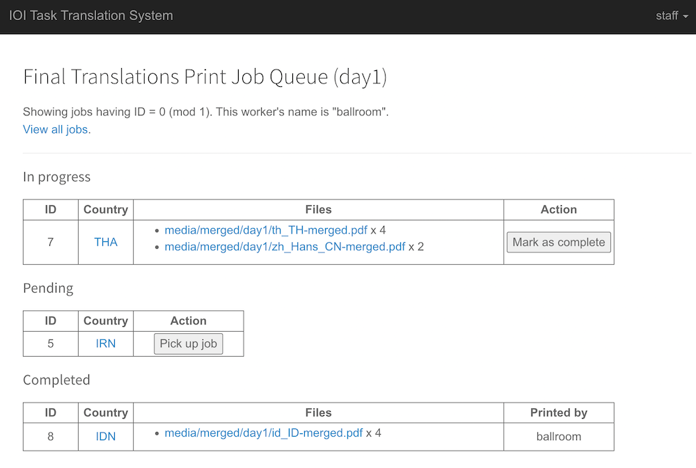
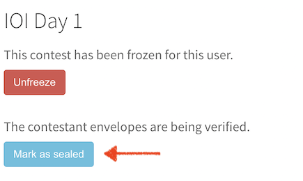

# Documentation

## Deployment

There are two methods:

1. Using Docker via the provided [docker-compose.yml](../docker-compose.yml) file.
2. Using Ansible via [IOI automation scripts](https://github.com/ioi/automation/tree/master/translation).

It is advised to add Nginx basic auth on top of the public URL.

IMPORTANT: Make sure all URLS under `/media/*` should NOT be publicly accessible without auth, as it contains the PDF files of the tasks.

The IOI automation scripts already take care of the above security concerns.


## Basic Concepts

There are three user accounts used for administering the system:

- `admin`: has full access to the Django admin interface.
- `ISC` (the International Scientific Committee): manages tasks and their primary English
  statements. ISC belongs to the `editor` group in Django, which can be given some rights
  to the Django admin interface.
- `staff`: monitors translations and handles printing.

There is also a translators' account for each combination of a country (a.k.a. team) and a language.
If a country translates to multiple languages, they should get multiple accounts.

A team consists of:

- One or more **leaders**, who will receive the team user account for task translation.
- Zero or more **on-site contestants**, who will receive printed task translations.
  For each contestant, the leaders pick the translation to print: it could be their
  their translation, somebody else's translation, or no translation.
- Zero or more **online contestants**, which will NOT receive printed task translations.

Before the start of a contest translation day, the admin creates a contest in the
system. Then, the ISC creates the tasks for the contest. For each task, ISC adds
the problem statement in English, and then they release the first version of the task.
After all tasks have been released, the admin marks the contest as public.
The teams then see the tasks and start translating.

During the translation session, the staff can monitor the translation status of all
the teams. On-site teams can also request to print their current translation for
a task, which will be monitored by staff as well.

When a team has finished translating a task, they can **finalize** their translation.
After all tasks are finalized, the team can **submit** the translations for printing.

The staff will see the submitted translations, print the translations accordingly
(one copy per language per task per on-site contestant). The team leaders then can
verify the translations and the staff can mark the translations as **sealed**.
This is the end of the translation session for the team.
Optionally, the team can opt out of the verification process when submitting.


## Initial setup

There are 3 administrator users: `admin`, `ISC`, and `staff`.
The IOI automation scripts will add those users. If Docker is used, the users will need to be added manually:

```
docker-compose exec app bash
```

and then:

```
python3 manage.py loaddata initial_data.json
```

### Changing administrator user passwords

Initially, each of the administrator user's password is the same as the
username. For security reasons, we need to change the passwords of all the
three users. To do this, log in as `admin`, go to `Trans` -> `Users`, select
a user, and change the password using the provided form.

### Adding countries and languages

Default countries and languages data are provided at `data/countries.csv` and `data/languages.csv`. Modify them as necessary.

Then, log in as `admin`, go to `Trans` -> `Countries` -> `Import`, select the CSV file, choose the `csv` format, and click `Submit`.
Likewise for languages.

### Adding users

Similarly, we will import the users via a CSV file. Beware that Django administration lists two tables called `Users`.
You should use the one under "Trans", not under "Authentication and authorization".

See the default CSV file at `data/users.csv`. Modify the file as necessary. Here is the explanation of each column:

- `username`: the username, in most cases should be equal to the `country`.
- `raw_password`: the password (generate it).
- `country`: the 3-letter code country of this user.
- `language`: the language this user is translating into. Set as `en` if this user is not translating.
- `is_onsite`: `1` if the user is translating on-site, `0` otherwise

### Adding contestants

Finally, we should import contestants from a CSV file, see the defaults in `data/contestants.csv`.
Each contestant has the following columns:

- `user`: the name of the user who translates for this contestant (usually equal to the country code)
- `code`: the code of the contestant (e.g., `GHA1`).
- `name`: the full name of the contestant
- `on_site`: `1` if they are competing on-site, `0` otherwise

## Contest & Task Management

### Adding contests

To add a contest, log in as `admin`, go to `Trans` -> `Contests` -> `Add contest`.

The _slug_ is an alphanumeric identifier used in URLs.

The _public_ flag determines if the contest is visible to the translators.

If a contest is marked as _frozen_, its translation can no longer be edited.

### Adding tasks

To add a task, log in as `ISC`. Then, click the menu on the top-right corner, and select `Add New Task`.

The _name_ of the task is the alphanumeric codename used in the contest system.

### Writing task statements

ISC can start adding the task statement via the embedded editor.
The left pane is used for editing, the right one shows a preview.

The statements are written in Markdown (the [Marked.js dialect](https://marked.js.org/).
Mathematical expressions are supported using [KaTeX](https://katex.org/) syntax.

It is advisable to write each sentence in a separate line, to make it easier for the translators to track the translation.

To insert an image in the task statement, admin must first upload the image file as an attachment (`Trans` -> `Attachments`).
Then, the image can be added in the statement using this Markdown syntax: ``.

### Releasing ISC version

Once the statement of a task is final, ISC should release the first version.
This is done using the "Release" button in the editor.

### Making contests public

After the ISC has added all tasks of a contest, the admin can make the contest public by ticking the `Public` checkbox.
Once a contest is public, the translators will be able to see the latest released version of each task in the contest.

### Releasing further versions

Later, the ISC can decide to update the official statement and release
a new version. Each release comes with a release note visible to the translators.

## Monitoring Translations

### Viewing overall translation status

Upon login, the `staff` user will be presented with the translation status of all teams.

The User, Team, and Language columns are self-explanatory.

The Status column denotes the status of the overall translation:

- `In Progress`: the team has not submitted the translation yet.
- `Printing`: the translations have been submitted and they are now in the print queue.
  `(needs seal)` is added if manual verification and sealing is requested.
- `Done (sealed)`: the translation have been printed and sealed
  (sealed by the staff if the team opted out of verification).
- `Done (remote)`: the translations have been submitted and the team is off-site,
  so nothing else needs be done.

The last column contains status of the translation for each task:

- :page_facing_up: : shows a PDF file with a finalized translation.
- :heavy_minus_sign: : the team is not translating.
- :question: : there is no translation yet.
- :pencil2: : the team is still editing the translation.
- :heavy_multiplication_x: : the team decided not to translate this task.

### Updating translation status

Staff can click on each row in the User column, which will show the detailed translation
status status of that user (team).

Here, staff can:

- Force-freeze team's overall translation or individual task translations.
- Force-reopen (unfreeze) team's overall translation or individual task translations.
- View and edit the assignment of translations to contestants.
- Declare contestant envelopes (containing printed translations) sealed by the team, which will mark the translation as done.

### Showing public translation status

We can show the overall translation status to all teams in the translation room, by clicking the `Public View` in the menu.
It shows the same data as the staff's status page, but packed, so that it fits on a single large screen.

## Handling Printing Queues

For each contest, there are two printing queues:

- **draft** print jobs for a working version of a team's translation of a task.
  They can be requested by clicking a button in the edit interface.

- **final** print jobs for finalized translations.
  There will be (at most) one such print job per on-site team.
  If the `PRINT_BATCH_WHOLE_TEAM` setting is `False`, the job will consist of separate
  files for contestants.

If you want to use duplex printing, set `PRINT_BATCH_DUPLEX` to `True`
to make each task start at an odd page.

### Print workers

### Printing jobs

Each queue can be handled by one or more "worker". A worker represents one physical printer station, attended by a runner.

We can distribute the load between available printers. Suppose that there are 3 printers. We can set so that:

- the first printer gets all jobs with ID = 0 (mod 3)
- the second printer gets all jobs with ID = 1 (mod 3)
- the third printer gets all jobs with ID = 2 (mod 3)

As instructed in the page, to see the worker view, append `?name={worker name}&count={worker count}&mod={job ID mod}`. Some examples:

- `?name=ballroom-draft&count=1&mod=0`
- `?name=ballroom&count=1&mod=0`
- `?name=ballroom&count=3&mod=2`

|||
|-|-|

The runner at each printer station can then pick up a job, click on each file and print one or more copies of the document, and then mark the job as complete.

**NOTE**: As explained above the printing itself is done manually by the runners. It is NOT automated! This system is not connected to any printer.

After completing a final translation print job, the runner should collect the printed documents and contestant envelopes, reach out to the team leaders, and seal the envelopes. Then, the runner should click on the country link, and then click the "Mark as sealed" button.


